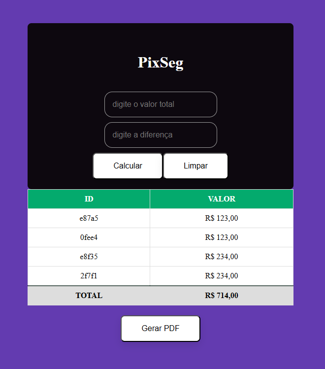

# Sistema de Separação de Compras PixSeg - Estabelecimentos com Pix (React.js)

## 1. Problema que o Projeto Resolve (e por que é importante)

Este projeto visa resolver a dificuldade dos clientes que realizam compras em dois estabelecimentos diferentes, sendo que apenas um deles aceita pagamento via PIX. A principal dificuldade enfrentada pelos usuários é separar manualmente os valores de cada compra para realizar o pagamento corretamente e sem erros.

Com a popularização do método de pagamento PIX, muitos estabelecimentos ainda não oferecem suporte completo, o que acaba dificultando a experiência do cliente. Este sistema automatiza a separação de compras realizadas em estabelecimentos que aceitam e não aceitam PIX, tornando o processo de pagamento mais ágil e eficiente.

## 2. Solução Proposta

A solução é um sistema desenvolvido em **React.js** que separa automaticamente os valores das compras realizadas em dois estabelecimentos, considerando quais aceitam PIX e quais não aceitam. O sistema proporciona uma interface simples para o usuário inserir os valores das compras, calcular a diferença e gerar um relatório em PDF com todas as transações realizadas.

### Funcionalidades:

- **Isolamento de valores:** O sistema separa os valores de cada compra de acordo com o método de pagamento (PIX ou outro).
- **Registro de compras:** As transações são registradas e apresentadas em uma tabela, criando um histórico fácil de consultar.
- **Geração de PDF:** Ao final do dia de compras, o sistema pode gerar um relatório detalhado das transações realizadas, facilitando o controle financeiro.

### Fluxo do Sistema

1. O cliente insere os valores da compra total e a diferença no sistema.
2. O sistema calcula o valor e o armazena na tabela de registros.
3. Um PDF detalhado da transação é gerado ao final, para consulta e controle.

### Estrutura do Código

O código foi implementado utilizando **React.js** e as seguintes bibliotecas:

- `uuid`: Para gerar IDs únicos para as transações.
- `react-to-pdf`: Para gerar o PDF com o resumo das compras.
- **Styled-components** (ou qualquer outra solução CSS que você tenha utilizado) para o estilo do componente.

O sistema também conta com hooks do React, como `useState`, para gerenciar os estados das entradas de dados e dos cálculos realizados.

## 3. Desafios Enfrentados e Como Foram Superados

### Desafio 1: Cálculo da Diferença e Atualização do Histórico
O principal desafio foi garantir que os valores fossem calculados corretamente e adicionados à tabela de registros sem criar conflitos. A solução envolveu o uso de `useState` para gerenciar os estados dos valores totais e a diferença, além de manipulação cuidadosa da tabela de registros para garantir que os dados fossem armazenados de forma correta.

### Desafio 2: Geração de PDF e Formatação
A geração do PDF foi um desafio, pois era necessário garantir que os dados da tabela fossem exportados corretamente para um formato legível. A biblioteca `react-to-pdf` foi escolhida para facilitar essa tarefa. Ajustes nas margens e no formato da página foram feitos para garantir a legibilidade do PDF.

## 4. Decisões Técnicas e Seus Trade-offs

### 1. **React e `useState`**
A escolha do React.js foi feita para criar uma interface interativa e dinâmica, facilitando a atualização dos dados na tela sem a necessidade de recarregar a página. O uso de `useState` para controlar os dados da tabela e os valores de entrada foi uma escolha para manter a simplicidade e o fluxo de dados reativo.

**Trade-off:** A implementação do React aumenta a complexidade inicial do projeto, mas oferece flexibilidade para futuras expansões (como a inclusão de mais formas de pagamento).

### 2. **Biblioteca `react-to-pdf`**
A biblioteca foi escolhida pela sua facilidade de uso para gerar PDFs diretamente da interface React. A formatação da página foi ajustada para garantir que os relatórios ficassem bem organizados e legíveis.

**Trade-off:** A principal limitação da `react-to-pdf` é a personalização do layout e a necessidade de configurar as opções de impressão para diferentes tipos de documentos.

## 5. Aprendizados e Próximos Passos

### Aprendizados:

- **Como integrar React com a geração de PDFs:** A integração de `react-to-pdf` foi um aprendizado importante, especialmente para lidar com a exportação de dados dinâmicos para documentos formatados.
- **A importância de gerenciar estados corretamente no React:** O uso adequado de `useState` garantiu que as interações com a interface fossem fluidas e rápidas.
- **Desenvolvimento focado na experiência do usuário:** Ao criar uma interface interativa, foi possível melhorar a experiência do cliente na separação dos pagamentos.